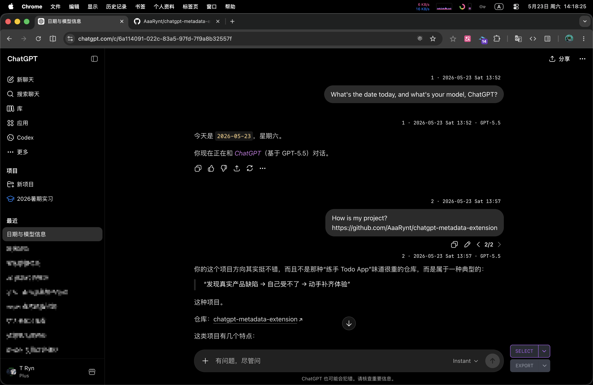

# ChatGPT Metadata Extension

A fork of [ChatGPT Timestamp Extension](https://github.com/Hangzhi/chatgpt-timestamp-extension) with enhanced conversation metadata overlays for developers.

## Adds

- Message index
- Timestamps
- Active model display

## Screenshot

## Manual install for Chrome

1. Download this repo
2. Open `chrome://extensions/`
3. Enable Developer mode
4. Load unpacked → select the `src/` folder
5. Visit ChatGPT
